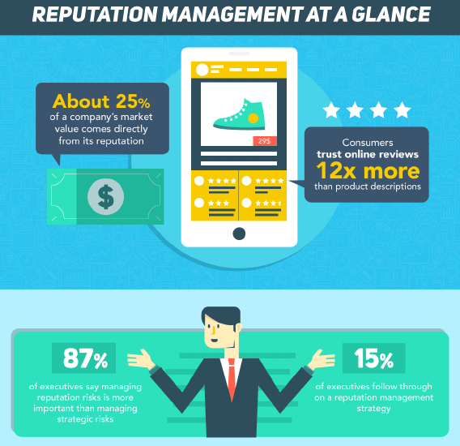
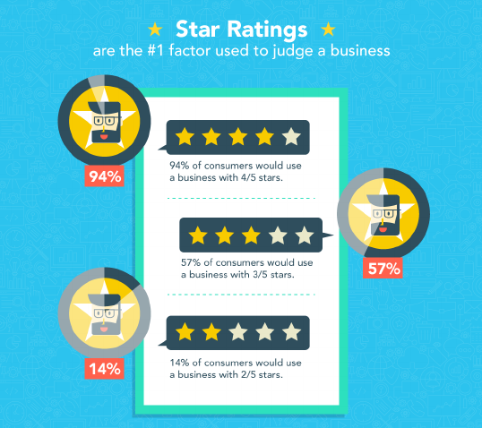
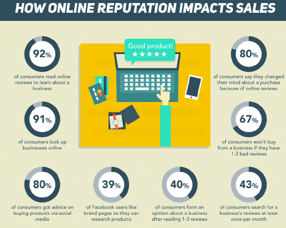
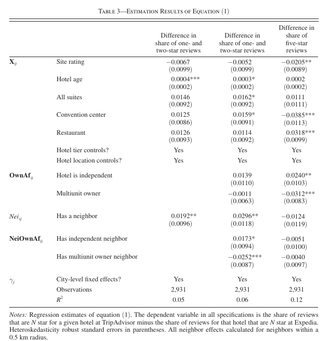

class: font160
# Learning Goals for this Week

* Define User Generated Content and Social Media 
* Identify reasons for the growth of social media 
* Explain the causal link between UGC and demand 
* Describe how online reputation management by firms impacts their subsequent reputation 
* Summarize how incentivized reviews impact rating behaviour and consumer demand
* Diagnose situations where fake reviews are more or less prevalent
* Identify the effect of fake reviews on future ratings, product sales and consumer welfare 

---
class: inverse, center, middle

# Preliminaries

---
class: font160
# Where Are We Now? 

```{r, echo = FALSE, fig.align = "center", out.width="35%"}
url <- "figs/pngtree-pile-of-cartoonish-cute-doodle-theme-books-png-image_6871556.png"
knitr::include_graphics(url)
```

Course Themes:

1. `r icons:::icon_style(icons::fontawesome("check", style = "solid"), scale = 1)` Measuring Advertising Effects
2. **User Generated Content & Social Media**
  * `r icons:::icon_style(icons::fontawesome("bullseye", style = "solid"), scale = 1)` Online Reviews

---
class: font160
# Our learning journey... 

.center[.font120[Understanding causal effects of Social Media on Marketing Outcomes]]

*Previously*: Measuring incremental (casual) effects of advertising

* Best practice: Field experiments

*The next three weeks:*

* **Today**: **User Generated Content, Ratings and Reviews**
* Next week: Influencers & Word of Mouth
* In two weeks: Firm Actions on Social Media

`r icons::fontawesome("rocket", style = "solid")` Challenge: Hard to run *controlled* field experiments on social media content

---
class: font140
# Today's Topic Coverage

Does Online Reputation Matter?

* [Luca (2016)](https://papers.ssrn.com/sol3/papers.cfm?abstract_id=1928601)

Should Managers Respond to Reviews?

* [Proserpio & Zervas (2017)](https://doi.org/10.1287/mksc.2017.1043)

Should Managers Incentivize Reviews?

* [Fradkin & Holtz (2023)](https://doi.org/10.1287/mksc.2023.1439)

When does review manipulation (fake reviews) occur?

* [Mayzlin, Dover and Chevalier (2014)](https://pubs.aeaweb.org/doi/pdfplus/10.1257/aer.104.8.2421)

*BONUS*: What are the (consumer) impacts of fake reviews?

* [He, Hollenbeck & Proserpio (2022)](https://doi.org/10.1287/mksc.2022.1353)


---
class: inverse, center, middle

# The Growth of Social Media

---
class: font140
# Social Media Matters!

.center[.font140[**Massive growth in social media use over the last two decades**]]

* 2005: 9% of Internet users aged 18-29 used social media (Aral, 2020)

* 2021: 53.6 % of the *world's population* uses social media (Hootsuite, 2021)
    * That's 4.2 billion people! 
    * Average daily usage is approx. 2 and a half hours 


---
# Social Network Popularity Over Time

```{r, echo = FALSE, fig.align = "center"}
knitr::include_graphics("https://www.smartinsights.com/wp-content/uploads/2020/04/Growth-of-social-networks.png")
```

Image Source: Our World in Data, 2021 "[The rise of social media](https://ourworldindata.org/rise-of-social-media)" 

---
# Social Media Informs Purchasing

```{r, echo = FALSE, fig.align = "center", out.width="75%"}
knitr::include_graphics("https://www.smartinsights.com/wp-content/uploads/2020/04/How-social-media-informs-purchase-decisions.png")
```

Image Source: Global Web Index, 2021 "[Social media marketing trends in 2021](https://www.globalwebindex.com/reports/social)" 

---
class: .font160
# Some Useful Definitions

<br>

.font140[
**User Generated Content**: Content that is generated or created by an internet user who is a consumer of this information or content
]

.font140[
**Social Media**: The online platforms that host this content
]

* Think of these as the working definitions for our course
* More liberal than "*just* Facebook / Snap / TikTok"

* People have a tendency to be use these terms relatively interchangeably 
  * (include me as one of the "people")

---
class: font160
# Why Did Social Media Take off?

Three factors:

* **Digital Social Networks**
  * Structured information flow

* **Machine Intelligence**
  * Recommendations of friends and content over the network

* **Smartphones**
  * "Always on"
  * Feeds our social brain


---
class: inverse, center, middle

# Does Online Reputation Matter?

---
# Online Reputation Matters

```{r, echo = FALSE, fig.align = "center", out.width="65%"}

```

Image from [WebpageFX](https://www.webpagefx.com/)

---
# Online Reputation Effects Perceptions

```{r, echo = FALSE, fig.align = "center", out.width="70%"}

```

Image from [WebpageFX](https://www.webpagefx.com/)

---
# Online Reputation Effects Sales

```{r, echo = FALSE, fig.align = "center", out.width="80%"}

```

Image from [WebpageFX](https://www.webpagefx.com/)

---
class: font160
# Why Online Reputation Matters

Buyers need to trust sellers

* Product descriptions
* Fulfilling transactions 

Sellers also need to trust buyers  (though not our focus)

* Ensure buyer will pay
* Abide by terms of service

Where does this trust come from?

$\implies$ **reputation systems** 

... and design choices made by a marketplace

---
class: font160
# Motivation 

**Strategic Question**: Do consumer reviews have causal impact on demand for experience goods

* *Experience goods*: some attribute (eg. quality) remains unknown until purchase 

**Why relevant?** 

* Review platforms prevalent, heavily used 
* But reviews noisy, difficult to interpret 
* And other mechanisms exist for solving info asymmetry 
  * Chain affiliation, Advertising, Expert reviews

**Industry studied**: Restaurants

---
class: font160
# How to answer this question? 

<br>

.center[`r icons::fontawesome("question", style = "solid")` **How would you answer this question?**]

<br>

Assume access to the following data: 

* Yelp star ratings over time 
* Restaurant revenue 
* Seattle, 2003 through 2009

---
class: clear

---
class: font160
# How Luca answers this question 

<br>

**Running an experimenter controlled study is impossible** 

* Can't manipulate star ratings ethically 
* How to display different ratings to people in the same city?

**Solution**: Exploit "jumps" in ratings due to Yelp's page design 

* Average Review Score for a restaurant is continuous [0 - 5] ... 
* But displayed as rounded to the nearest half star 
* "Similar" restaurants will be displayed with different star ratings

**Data:** as described on previous slide


---
# How Yelp Displays Ratings 

```{r, echo = FALSE, fig.align = "center", out.width="80%"}
url <- "figs/luca_yelp_halfpoints.png"
knitr::include_graphics(url)
```

* Shows ratings rounded to half-stars 
* But *actual* average ratings do exist

---
class: font160
# First Step: Yelp Reviews & Revenue? 

.pull-left[ 

```{r, echo = FALSE, fig.align = "center", out.width="80%"}
url <- "figs/luca_yelp_revenue.png"
knitr::include_graphics(url)
```

]
.pull-right[

First Step: **Correlation between Yelp Ratings and Revenue?**

* One star increase associated with 5.4% increase in revenue 

Why can't we stop here? 

* Yelp rating may be correlated with other unobservable factors 
* That are correlated with revenue 

$\implies$ **Omitted Variable Bias**

]

---
# Exploiting Rounded Star Ratings

```{r, echo = FALSE, fig.align = "center", out.width="80%"}
url <- "figs/luca_rdd_rounding.png"
knitr::include_graphics(url)
```

---
class: font160
# Regression Discontinuity Design

Core Idea: **Natural Experiment** where **Treatment allocated based on a cutoff score**

In this case: 

* Restaurant A: Avg Score 4.24 $\rightarrow$ 4 star 
* Restaurant B: Avg Score 4.25 $\rightarrow$ 4.5 star 
* Treatment is the extra half star

But wait! 

* Aren't restaurants with a higher Avg Rating simply "better" ...
* ... And won't that be what we're estimating? 
* (And isn't that the problem with the simple regression!?)

---
class: font160
# Regression Discontinuity Design

**RDD focusses on the area right around the cutoff**

* So comparing restaurants with **very similar average scores** 

**Main Idea**: Within this group, it's **essentially random** whether you are **assigned 4 or 4.5 stars** 

* Think of this as "barely in" vs "barely out"
* These **restaurants should be almost identical** except one's star rating got rounded up
* Seems like a good control group!
* Remark: **Essentially random is an assumption**!
  * Good, very recent papers will show you that around the cutoff, observable characteristics of treatment and control units are not jumping around
  * And that there is no manipulation 

---
class: font160
# RDD as a Natural Experiment

<br>

* **Treatment**: earning an extra half star on Yelp

* **Treatment Group:** Restaurants just *above* the cutoff to be rounded up by one half of a star

* **Control Group:**  Restaurants just *below* the cutoff to be rounded up by one half of a star

* **Outcome Variable**: Log(Revenue)


---
class: font160
# Main Results

```{r, echo = FALSE, fig.align = "center", out.width="60%"}
url <- "figs/luca_rdd_main.png"
knitr::include_graphics(url)
```

Estimates for half star ratings jump, normalized to one star changes 

$\implies$ **One star improvement leads to an approx 9% increase in revenue** 


---
class: font140
# Chain vs Independents 

```{r, echo = FALSE, fig.align = "center", out.width="60%"}
url <- "figs/luca_rdd_chains.png"
knitr::include_graphics(url)
```

**Yelp increases consumer's value of going to an independent restaurant** 

* Which translates into higher revenue 
* Luca points to this being due to consumers learning about quality

---
class: font130
# Crowding Out of Chains?

```{r, echo = FALSE, fig.align = "center", out.width="80%"}
url <- "figs/luca_rdd_crowd_out.png"
knitr::include_graphics(url)
```

**Chains experience decline in revenue relative to independent restaurants post-Yelp**

---
class: font160
# Takeaways

* **Reviews have a positive, causal impact on demand** 
  * As **measured via** a Regression Discontinuity Design using **star ratings**  

* One star improvement leads to an approx 9% increase in revenue

* **Effect for independent restaurants** rather than chains 

* **Chain restaurants decline in revenue after Yelp introduced** 

$\implies$ Review websites alleviate information uncertainties about products & consumers respond to ratings

---
class: inverse, center, middle

# Should Managers Respond to Reviews?

---
class: font160
# Motivation 

**Strategic Question**: Do management responses to online reviews impact future ratings?

**Why relevant?** 

* Ratings matter for demand 
* Legal, endorsed by platforms (as opposed to review fraud)
* Widely adopted by managers 

*Setting*: 

* Hotel Industry (Trip Advisor and Expedia)

*Analysis*: 

* Difference in Differences with a Natural Experiment 

---
class: font160
# Why does this matter?

<br>

.center[`r icons::fontawesome("question", style = "solid")` **What do you infer when you see responses to reviews?**]

<br>
<br>

.center[`r icons::fontawesome("question", style = "solid")` **Are star ratings the outcome variable you care about? Why?**]


---
class: font140
# The Natural Experiment

* **Treatment**: Managers respond to reviews on Trip Advisor
  * They can't on Expedia 
  * Treating management decision as a "suprise" (i.e. random shock) to future reviewers

* **Treatment Group:** Reviews of a Hotel on Trip Advisor

* **Control Group:**  Reviews of a Hotel on Expedia

* **Outcome Variable**: Star rating of reviews

* "Cross-platform": relative changed in star ratings between platforms after a reponse is written on Trip Advisor
  * Differences in level of ratings for same hotel on different sites not an issue ...
  * "Differenced out" in the Diff in Diff regression

---
class: font140
# Graphical Evidence

.pull-left[
```{r, echo = FALSE, fig.align = "center", out.width="90%"}
url <- "figs/pv_ashenfelterdip.png"
knitr::include_graphics(url)
```
]

.pull-right[

* **Dip in relative ratings in the month before managers begin adopting responses** 
  * akin to an "[Ashenfelter Dip](https://www.google.com/search?q=ashenfelter+dip)"
  * Drop reviews left up to 30 days before 

* **Relative increase in star ratings after responses begin** 
  * That appears permanent
]

---
class: font140
# Main Results 

.pull-left[
```{r, echo = FALSE, fig.align = "center", out.width="100%"}
url <- "figs/pv_xplatform_main.png"
knitr::include_graphics(url)
```
]
.pull-right[
**Management Responses lead to an increase in star rating of 0.097 stars** 

Is this a **big** effect?

* approx 3 percent increase on average Trip Advisor Rating
  * Hard to interpret ... 
* Translates to about 7.5% of the standard deviation in ratings  

]

.font70[**Never put t-statistics in parentheses on a regression table!**]

---
class: font150
# Visibility of Management Responses

.pull-left[
```{r, echo = FALSE, fig.align = "center", out.width="100%"}
url <- "figs/pv_xplatform_page_intuition.png"
knitr::include_graphics(url)
```
]
.pull-right[
**Do the responses need to be visible?**

Idea (intuitively):

* Reviewer 10 sees response on first page of TA 
* Reviewer 11 sees response on second page of TA 

$\implies$ Response more effective on Reviewer 10 than Reviewer 11
]


---
class: font150
# Visibility of Management Responses

.pull-left[
```{r, echo = FALSE, fig.align = "center", out.width="100%"}
url <- "figs/pv_xplatform_page.png"
knitr::include_graphics(url)
```
]
.pull-right[
**Effect is larger when responses are visible to the review writer**
]


---
class: font160
# Review Length Effects

```{r, echo = FALSE, fig.align = "center", out.width="80%"}
url <- "figs/pv_response_length.png"
knitr::include_graphics(url)
```

* More reviews after start responding
* Negative reviews become longer

---
class: font160
# Takeaways 

* **Responding to reviews increases future ratings** 

* After adopting responses, **ratings increase** by approx 0.1 stars (out of 5)
  * About **7.5 percent of a standard deviation**

* Effect larger when responses are visible to reviewer 
  * i.e. on first page  

* Also see more reviews, longer negative reviews 

---
class: inverse, center, middle

# Should Managers Incentivize Consumer Reviews?

---
class: font160
# Initial Thoughts...

<br>

.center[`r icons::fontawesome("question", style = "solid")` **Are you more likely to write a review if you are incentivised?**]

<br>
<br>

.center[`r icons::fontawesome("question", style = "solid")` **Would you rate differently as a result? Why?**]

---
class: font150
# Motivation 

**Strategic Question**: Does incentivizing consumer reviews improve market outcomes?

**Why relevant?** 

* Reviews indicative of quality
* More reviews $\rightarrow$ faster learning about seller quality
* Worry about representativeness of existing reviews and *biased beliefs* 
* Firms *do* this already (eg. Amazon, Wayfair, Walmart) 

*Setting*: 

* Airbnb

*Analysis*: 

* Field Experiment with Diff in Diff analyses 

---
# The Treatment

```{r, echo = FALSE, fig.align = "center", out.width="100%"}
url <- "figs/airbnb_incentivised_email.png"
knitr::include_graphics(url)
```

---
class: font150
# Experiment Design

* At the Airbnb listing level
  * Needs no prior reviews
  * Guest may not have reviewed in first week after stay

* **Treatment**: Email prompting review that offers $25 coupon if complete review

* **Treatment Group:** Consumer didn't review for a week, *receive incentivized email*

* **Control Group:**  Consumer didn't review for a week, standard email

* Approx 325,000 listings in each of treatment and control groups

---
# Effect on Reviews

```{r, echo = FALSE, fig.align = "center", out.width="70%"}
url <- "figs/airbnb_ratings.png"
knitr::include_graphics(url)
```

* (a) **Higher rate of reviews**, higher ratings before conditioning on treatment 
* (b) Ratings of treated listings **lower** than for control

---
class: font140
# Why Lower Reviews?

```{r, echo = FALSE, fig.align = "center", out.width="70%"}
url <- "figs/airbnb_why_lower.png"
knitr::include_graphics(url)
```

**Changes in the composition of who reviews**

* Budget conscious, shorter stays, multi-listing hosts

$\implies$ price sensitive consumers more likely to respond to incentivised reviews

---
class: font150
# What Happens after the Review?

```{r, echo = FALSE, fig.align = "center", out.width="70%"}
url <- "figs/airbnb_effect_listings.png"
knitr::include_graphics(url)
```

**No increase in demand** (on average)

---
class: font160
# Takeaways 

What do incentivised reviews do?  (at Airbnb)

* Induce **more reviews** 
* Lead to **less positive** reviews (no inflated ratings!)
* **No impact on demand** 

Remarks:

* Lack of impact on demand disputed by other papers

---
# Ratings Incentives & Disclosure 

```{r, echo = FALSE, fig.align = "center", out.width="100%"}
url <- "https://trustradiusnew.wpengine.com/wp-content/uploads/incentivized-example.png"
knitr::include_graphics(url)
```

.font70[Source: [Trust Radius (2022)](https://www.trustradius.com/vendor/b2b-reviews/ftc-incentivized-review-guidelines-welcome-to-the-party)]

---
# Ratings Incentives & Disclosure

```{r, echo = FALSE, fig.align = "center", out.width="90%"}
url <- "https://blog.grade.us/wp-content/uploads/2019/10/Capterra-review-incentive.png"
knitr::include_graphics(url)
```

.font70[Source: [Grade.us (2019)](https://blog.grade.us/online-review-incentives-2/)]

---
class: inverse, center, middle

# Online Review Manipulation

---
class: font160
# Motivation

.center[`r icons::fontawesome("rocket", style = "solid")` Reputation is most useful when it's not tainted by "fake reviews"]

**Strategic Question**: When does review manipulation occur?

* Are there more fake reviews there's more competition?
* Do smaller firms try to boost their reputation?
  * More positive fake reviews for firms hotels?
  * More negative reviews for larger competitors?

* **Why relevant:** Fake reviews lead to:
  * Lower consumer welfare through sub-optimal choices 
  * Mistrust in online reviews and reputation

---
class: font140
# Empirical Approach

**Data**: Travel sites in the US - TripAdvisor & Expedia
  * Star Ratings of all reviews for all hotels in subset of cities in the US
  * Supplement with hotel industry data from Smith Travel Research

**Empirical Approach**: Linear Regression

* Authors argue its some kind of difference in difference regression
<!---  * We'll cover DiD next week in labs --->
* This paper is not DiD in a 'standard sense'

**What makes all this work**:
  * TripAdvisor: Anyone can post at anytime
  * Expedia: Can only post if booked on Expedia and stayed one night in last 6 months
  * $\implies$ fake reviews are harder to post on Expedia
  * **Assumption**: Users on each platform value hotel characteristics equally

---
class: font130
# Regression Equation

Estimate the following equation:

$$
\begin{equation}
y_{ij} = X_{ij} B_1 + 
   \text{OwnAf}_{ij} B_2 +
   \text{Nei}_{ij} B_3+
   \text{NeiOwnAf}_{ij} B_4 +
   \sum \gamma_j + 
   \varepsilon_{ij}
\end{equation}
$$

Notation:

* $i$ hotels, $j$ city
* $y_{ij}$ Difference in share of $N$ star reviews between TripAdvisor and Expedia 
* $X_{ij}$ are hotel characteristics
* $\text{Nei}_{ij}$ = 1 if competitor hotel within 0.5 km, else zero
  * We care about these coefficients, $B_3$
* $\text{OwnAf}_{ij}$ are hotel ownership characteristics
  * We care about these coefficients, $B_2$
* $\text{NeiOwnAf}_{ij}$ are competitor hotels ownership characteristics
  * We care about these coefficients, $B_4$

---
class: font160
# Why this approach will work ...

Authors don't observe review manipulation directly $\implies$ infer it from data patterns

* It's easier to manipulate reviews on TripAdvisor...

The story goes something like this:

* If the fraction of low (high) reviews on TripAdvisor is larger than on Expedia 
* And consumers value the hotel equally between platforms 
* Then differences are likely due to review manipulation on TripAdvisor 

So let's check out the results...

---
# Main Results

```{r, echo = FALSE, fig.align = "center", out.width="67%"}

```

---
# Interpreting Results

Column 1:

* $B_3$: 0.0192 $\implies$ **hotels with a neighbouring competitor have a 1.9 percentage point increase in share of bad reviews**
  * approx. 7.5 percent increase compared to the baseline of 25 percent bad reviews

Column 2: 

* $B_3 + B_4$: $\implies$ **hotels with an independent hotel as a  neighbouring competitor have a 4.7 percentage point increase in share of bad reviews**
  * approx. 20 percent increase compared to the baseline of 25 percent bad reviews  

Column 3: 

* $B_2$: $\implies$  **independent hotels have a 2.4 percentage point increase in share of positive reviews**
  * approx. 7.5 percent increase compared to the baseline of 31 percent five star reviews

---
# Takeaways

1. **Hotels with neighbors have more negative reviews**
  * Suggestive of competitors giving each other negative fake reviews

2. If **neighbor is an independent** hotel, (1) is even **more likely** 

3. Independent hotels have higher reviews
  * Suggestive of positive review manipulation
  * But there are competing stories

**Punchline**: Evidence for fake reviews and manipulating online reputation
  * Either by competitors (negative) or by the firm itself (positive)

**Managerial Implications?**

* More for platform owners ...
* There's a need to try and monitor / control reviews

---
class: inverse, center, middle

# What are the impacts of fake reviews?

---
class: font160
# Motivation 

**Strategic Question**: Do fake reviews have a causal effect on sales?

**Why relevant?** 

* Prevalent practice
* Matters for platforms and sellers 

*Setting*: 

* Products on Amazon, Fake Review Facebook Groups

---
class: font160
# The Natural Experiment 

Setting: Amazon undertakes large scale purge of (fake) reviews

**Treatment**: Recruiting fake reviews starts 

**Treatment Group**: Products on Amazon that did recruit fake reviews on Facebook

**Control Group**: Products on Amazon that did **not** recruit fake reviews on Facebook

**When?**Before** March 15 2020, focus on three weeks around that date

**Idea**: Purge of reviews impacts products who recruit fake reviews but not those that don't


---
# Fake Review Recruiting

```{r, echo = FALSE, fig.align = "center", out.width="100%"}
url <- "figs/hpp_recruiting.png"
knitr::include_graphics(url)
```

---
# Fake Reviews Influence Business Metrics

```{r, echo = FALSE, fig.align = "center", out.width="80%"}
url <- "figs/hpp_trends.png"
knitr::include_graphics(url)
```


```{r, echo = FALSE, fig.align = "center", out.width="80%"}
url <- "figs/hpp_trends_2.png"
knitr::include_graphics(url)
```

---
class: font140
# Fake Reviews Hurt Consumers

```{r, echo = FALSE, fig.align = "center", out.width="60%"}
url <- "figs/hpp_did_onestar.png"
knitr::include_graphics(url)
```

Share of one-star reviews increases after recruiting fake reviews stops

$\implies$ harmful to consumers

---
class: inverse, center, middle

# Recap

---
class: font160
# Summary

.center[**User Generated Content matters to consumers**] 

* User generated star ratings increase demand for products where quality is uncertain and erodes value of chains 

* When firms respond to reviews, leads to improved reputation  

* Incentivised reviews do not seem to inflate ratings, or increase demand 

* Fake reviews are prevalent, more concentrated in competitive markets, impact sales and decrease consumer welfare

---
# License & Citation

Suggested Citation:

```{r, engine='out', eval = FALSE}
@misc{deerdsms2024,
      title={"Digital and Social Media Strategies: User Generated Content & Online Reputation"},
      author={Lachlan Deer},
      year={2024},
      url = "https://github.com/deer-marketing-lab/dsms-lecture-ugc"
}
```

<p style="text-align:center;"></p>

This course adheres to the principles of the Open Science Community of Tilburg University. 
This initiative advocates for transparency and accessibility in research and teaching to all levels of society and thus creating more accountability and impact.

<p style="text-align:center;"></p>
This work is licensed under a <a rel="license" href="http://creativecommons.org/licenses/by-sa/4.0/">Creative Commons Attribution-ShareAlike 4.0 International License</a>.